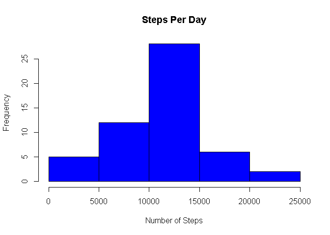
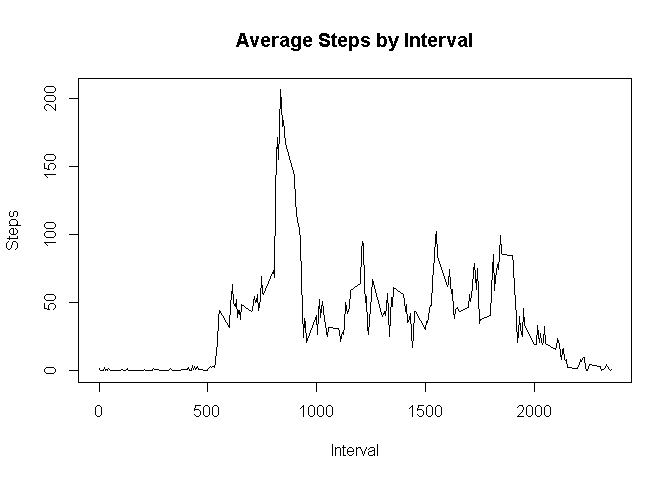
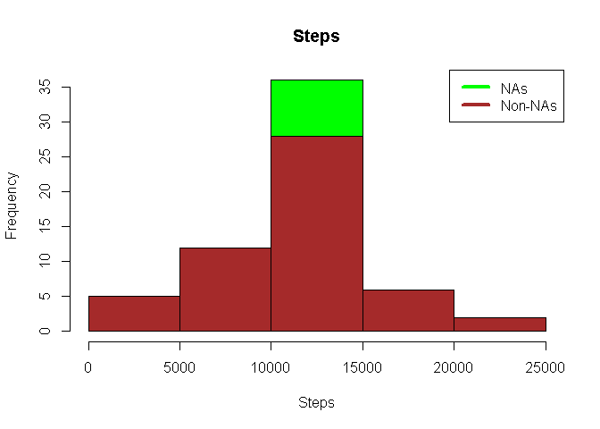
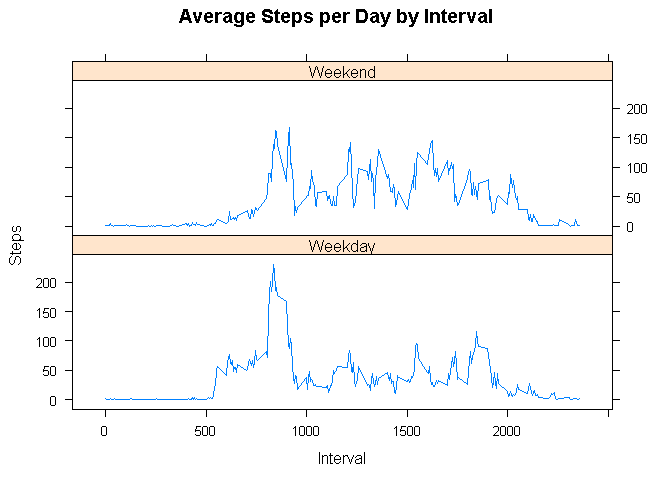

## Load Libraries in Windows 10

```r
library(tidyverse)
```

```
## -- Attaching packages --------------------------------------- tidyverse 1.3.0 --
```

```
## v ggplot2 3.3.3     v purrr   0.3.4
## v tibble  3.0.4     v dplyr   1.0.2
## v tidyr   1.1.2     v stringr 1.4.0
## v readr   1.4.0     v forcats 0.5.0
```

```
## -- Conflicts ------------------------------------------ tidyverse_conflicts() --
## x dplyr::filter() masks stats::filter()
## x dplyr::lag()    masks stats::lag()
```

```r
library(lubridate)
```

```
## 
## Attaching package: 'lubridate'
```

```
## The following objects are masked from 'package:base':
## 
##     date, intersect, setdiff, union
```

```r
library(lattice)
```

## Loading and preprocessing the data

```r
if (!file.exists("activity.csv") )
    {
     dlurl <- 'https://d396qusza40orc.cloudfront.net/repdata%2Fdata%2Factivity.zip'  
     download.file(dlurl,destfile='Factivity.zip',mode='wb')  
     unzip('Factivity.zip')
    }


activity <- read.csv("activity.csv",na.strings = "NA")
```


## What is mean total number of steps taken per day?

```r
steps_per_day <- aggregate(steps ~ date, activity, sum)
hist(steps_per_day$steps, main = paste("Steps Per Day"), col="blue",
     xlab="Number of Steps")
```

<!-- -->

```r
dev.copy(png, file = "figure1.png");
```

```
## png 
##   3
```

```r
dev.off();
```

```
## png 
##   2
```


```r
smean <- mean(steps_per_day$steps)
```


```r
smedian <- median(steps_per_day$steps)
```

The mean and median of the total number of steps taken per day is approximately
10766.19 and 10765, respectively.

## What is the average daily activity pattern?

```r
steps_by_interval <- aggregate(steps ~ interval, activity, mean)
plot(steps_by_interval$interval,steps_by_interval$steps, type="l", 
     xlab="Interval", ylab="Steps",main="Average Steps by Interval")
```

<!-- -->

```r
max_steps <- steps_by_interval[which.max(steps_by_interval$steps),1]
dev.copy(png, file = "figure2.png");
```

```
## png 
##   3
```

```r
dev.off();
```

```
## png 
##   2
```

Which 5-minute interval, on average across all the days in the dataset, contains  
the maximum number of steps? 835  

Note that there are a number of days/intervals where there are missing value. The  
presence of missing days may introduce bias into some calculations or summaries  
of the data.

Calculate and report the total number of missing values in the dataset. 
Devise a strategy for filling in all of the missing values in the dataset. The  
strategy does not need to be sophisticated. For example, you could use the  
mean/median for that day, or the mean for that 5-minute interval, etc.  
Create a new dataset that is equal to the original dataset but with the missing  
data filled in.  

Make a histogram of the total number of steps taken each day and Calculate and  
report the mean and median total number of steps taken per day. Do these values  
differ from the estimates from the first part of the assignment? What is the  
impact of imputing missing data on the estimates of the total daily number of  
steps?

## Imputing missing values

```r
NAs <- sum(!complete.cases(activity))  # count NAs
```

# fill-in

```r
meansteps <- aggregate(steps ~ interval, data = activity, FUN = mean)
```

```r
fill <- numeric()
for (i in 1:nrow(activity)) {
    obs <- activity[i, ]
    if (is.na(obs$steps)) {
        steps <- subset(meansteps, interval == obs$interval)$steps
    } else {
        steps <- obs$steps
    }
    fill <- c(fill, steps)
}
```


```r
data <- activity
data$steps <- fill
```

# histogram


```r
totsteps <- aggregate(steps ~ date, data = data, sum, na.rm = TRUE)
```


```r
hist(totsteps$steps, main = paste("Steps"), col="green", xlab="Steps")
hist(steps_per_day$steps, main = paste("Total Steps Each Day"), col="brown",
     xlab="Steps", add=T)
legend("topright", c("NAs", "Non-NAs"), col=c("green", "brown"), lwd=4)
```

<!-- -->

```r
dev.copy(png, file = "figure3.png");
```

```
## png 
##   3
```

```r
dev.off();
```

```
## png 
##   2
```


```r
sm <- mean(totsteps$steps)
meandiff <- sm - smean
```


```r
tm <- median(totsteps$steps)
mediandiff <- tm - smedian
```

The total number of missing values in the dataset is 2304.  The mean and median  
total number of steps taken per day is 10766.19. Do these values differ from the  
estimates from the first part of the assignment? Only the medians differ by 1.19.  
What is the impact of imputing missing data on the estimates of the total daily  
number of steps? We see an effect between 10000 and 150000 steps which increases   the frequency from about 27.5 to 35.  

## Are there differences in activity patterns between weekdays and weekends?

Use the dataset with the filled-in missing values for this part.


```r
# Create a new factor variable in the dataset with two levels – “weekday” and  
# “weekend” indicating whether a given date is a weekday or weekend day.
data$f = as.factor(ifelse(is.element(weekdays(as.Date(data$date)),                                       c("Saturday", "Sunday")), "Weekend", "Weekday"))

# Make a panel plot containing a time series plot 
fsteps <- aggregate(steps ~ interval + f, data, mean)
```


```r
xyplot(fsteps$steps ~ fsteps$interval|fsteps$f, main="Average Steps per Day by Interval",xlab="Interval", ylab="Steps",layout=c(1,2), type="l")
```

<!-- -->

```r
dev.copy(png, file = "figure4.png");
```

```
## png 
##   3
```

```r
dev.off();
```

```
## png 
##   2
```

